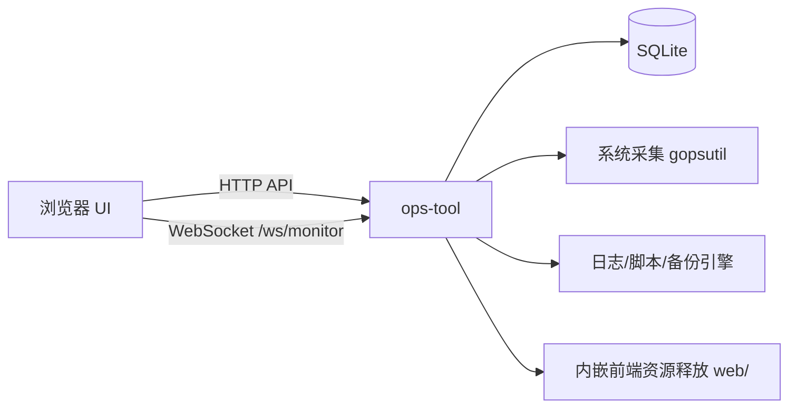

<div align="center">

# ops-tool

### 一体化运维控制台（单体部署 / 前后端同包 / 开箱即用）

<p>
  
  
  
  
</p>

<p>监控、日志、修复、备份、数据清理，全部在一个可执行程序里完成。</p>

</div>

---

## 亮点

- **单体可执行**：后端 + 前端同包发布，无需 Node.js。
- **前端内嵌释放**：程序启动时自动确保 `web/` 资源可用（已存在则不覆盖）。
- **实时监控**：支持 HTTP 拉取 + WebSocket 推送（`/ws/monitor`）。
- **跨平台交付**：支持 Windows / Linux（amd64、arm64）。
- **Windows 直出运行**：直接分发 `ops-tool-windows-*.exe` 即可运行，无需安装器。

## 功能矩阵

| 模块 | 能力 | 说明 |
| --- | --- | --- |
| 系统监控 | CPU / 内存 / 磁盘 / IO / 网络 / 端口 / 进程 | 支持趋势落库，支持实时推送 |
| 流程监控 | 脚本执行 / 数据备份 / CI/CD 流水线 | 统一聚合展示 |
| 日志分析 | 关键字检索 / 级别过滤 / 规则匹配 / 导出 | 支持自定义日志源 |
| 修复工具 | 脚本上传 / 执行 / 历史留痕 | 支持 `ps1/sh/bat/cmd` |
| 数据备份 | 文件 / 数据库命令 / ES 命令 | 结果可下载 |
| 数据清理 | 目录扫描 / 大文件分析 / 垃圾清理 | 支持扫描中断（请求取消） |
| 配置管理 | YAML + SQLite 同步 | 启动自动初始化 |

## 架构预览



## 项目结构

```text
.
├── cmd/ops                          # 程序入口
├── config/config.yaml               # 主配置
├── internal/monitor                 # 监控采集
├── internal/logs                    # 日志分析
├── internal/script                  # 脚本执行
├── internal/backup                  # 备份管理
├── internal/cleanup                 # 数据清理（扫描/大文件/垃圾清理）
├── internal/store                   # SQLite 持久化
├── internal/web                     # HTTP + WS 路由
├── scripts/build.ps1                # 多平台构建
└── web                              # 页面模板与静态资源
```

## 快速开始

### 1) 源码运行

```bash
go mod tidy
go run ./cmd/ops
```

默认访问：`http://127.0.0.1:18082`（实际以 `config/config.yaml` 为准）。

### 1.1) 启用流量抓包（Windows，CGO + Npcap）

先安装 Npcap/Win10Pcap（需有 `wpcap.dll`），然后使用：

```powershell
./scripts/run-cgo.ps1
```

或手动设置：

```powershell
$env:GOPROXY="https://goproxy.cn,direct"
$env:CGO_ENABLED="1"
go run ./cmd/ops
```

### 2) 直接运行二进制

```bash
# Windows
./ops-tool-windows-amd64.exe

# Linux
./ops-tool-linux-amd64
```

程序会在运行目录下自动使用（或创建）以下内容：

- `config/config.yaml`
- `data/ops-tool.db`
- `web/templates/index.html`
- `web/static/*`

## Windows 使用方式

- 直接运行 `ops-tool-windows-amd64.exe` 或 `ops-tool-windows-arm64.exe`
- 默认读取/生成 `config/config.yaml`、`data/ops-tool.db`、`web/*`
- 不依赖安装器，不写控制面板卸载项

## 配置示例

```yaml
core:
  web:
    listen: 0.0.0.0:18082
  sqlite:
    path: data/ops-tool.db
  timezone: Asia/Shanghai

monitor:
  refresh_seconds: 5
```

重点配置段：

- `core`：监听地址、SQLite 路径、时区
- `monitor`：采集项、SNMP、nmap
- `log_analysis`：日志源、规则、返回行数
- `repair`：脚本根目录与脚本定义
- `backup`：备份目录和备份命令
- `extensions`：默认阈值、并发等扩展参数

## 关键接口

- `GET /api/monitor`：实时监控快照
- `GET /api/monitor/trends`：趋势数据
- `GET /ws/monitor`：监控实时推送
- `GET /api/logs/apps` / `GET /api/logs/{app}`：日志源与检索
- `POST /api/scripts/run`：脚本执行
- `POST /api/backups/run`：触发备份
- `GET /api/cicd/runs`：流程运行记录
- `GET /api/cleanup/meta`：数据清理元信息
- `POST /api/cleanup/scan`：目录扫描/大文件分析
- `POST /api/cleanup/garbage`：垃圾清理（支持 dry-run）

## 构建产物

运行 `./scripts/build.ps1` 默认输出：

- `dist/ops-tool-windows-amd64.exe`
- `dist/ops-tool-windows-arm64.exe`
- `dist/ops-tool-linux-amd64`
- `dist/ops-tool-linux-arm64`

## 运行依赖说明

按需安装以下外部命令（启用对应功能时才需要）：

- `nmap`
- PowerShell（`.ps1`）或系统 Shell（`sh/bash`）
- 数据库/ES 备份命令（如 `mysqldump`）
- Windows 如安装 Everything CLI（`es.exe`），数据清理可检测到快速索引器

---

## License

内部项目（按你的团队规范使用）。
